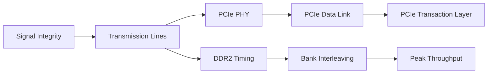

# High-Speed Computer Interfaces — PCIe, DDR2 & Signal Integrity

Coursework portfolio covering **high-speed digital interfaces from the electrical layer up to protocol-level transactions**. The repository combines LTspice transmission-line studies, a multi-phase PCIe Gen1 simulation project, and DDR2 timing/throughput scheduling experiments.

> **Course context:** Computer Interfaces, Sharif University of Technology  
> **Primary tools:** LTspice · Vivado · QuestaSim · Verilog/SystemVerilog  
> **Documentation:** the original Persian coursework reports were reviewed to build the English technical summaries in this repository. The public repo keeps original student-authored source/schematic files while omitting bulky PDFs and third-party/vendor material.

## What this repository demonstrates

- Transmission-line reasoning using reflection coefficients, propagation delay, source/load termination, impedance discontinuities, and stubs.
- PCIe Gen1 x1/x4 simulation across the **Physical, Data Link, and Transaction layers**.
- 8b/10b symbol inspection, comma alignment, descrambling, LTSSM observation, TS1/TS2 training analysis, lane reversal/polarity concepts, x4 byte striping, and skew experiments.
- Controlled PCIe error-injection experiments and robustness checks against training/data-path perturbations.
- PCIe configuration and memory transactions, BAR sizing/addressing, multi-function tests, throughput measurement, and a memory-mapped GPIO experiment.
- DDR2 timing-aware scheduling with `tRCD`, `tRP`, `tWR`, `tRAS`, `tRTP`, burst length, auto-precharge, bank interleaving, and steady-state throughput analysis.



## Project map

| Area | Work | Representative result |
|---|---|---|
| [Signal integrity](signal-integrity/) | LTspice transmission-line experiments | Demonstrated source termination, discontinuity reflections, and stub-length effects |
| [PCIe — Physical layer](pcie/phase-1-physical-layer/) | Gen1 x1/x4 link analysis | x4 byte striping verified; small lane skew of 0/0.1/0.2/0.3 ns remained decodable in the tested model |
| [PCIe — Data Link](pcie/phase-2-data-link/) | DLLP/LCRC/replay concepts + fault injection | Automated perturbation sweeps while monitoring LTSSM and end-to-end functional tests |
| [PCIe — Transaction layer](pcie/phase-3-transaction-layer/) | Config/TLP/BAR/multi-function/GPIO experiments | 256 KB BAR address tests passed; measured benchmark ≈ **31.874 Mb/s** in the coursework testbench |
| [DDR2](ddr2/) | Seven timing/scheduling scenarios | Efficiency progressed from **21.05%** in a short single-bank case to **100%** steady-state bus utilization in long four-bank streams |

## Repository layout

```text
.
├── signal-integrity/
│   ├── hw1/                 # reflections and transient transmission-line behavior
│   └── hw2/                 # termination, discontinuities, and stubs
├── pcie/
│   ├── phase-1-physical-layer/
│   ├── phase-2-data-link/
│   └── phase-3-transaction-layer/
├── ddr2/
│   └── scenarios/           # seven student-authored scenario drivers
└── docs/
    ├── SOURCE_AND_ATTRIBUTION.md
    └── ORIGINAL_ARCHIVE_MAP.md
```

## Selected technical results

### PCIe

The simulation work used a PCIe Gen1 link at **2.5 GT/s**. Phase 1 followed the received serial stream through deserialization, comma alignment, 8b/10b decoding, and descrambling, and then extended the design from x1 to x4 to study lane striping and skew. Later phases introduced physical-line perturbations, monitored LTSSM behavior, exercised configuration/memory transactions, expanded BAR0 to 256 KB, tested two functions, and replaced the endpoint memory behavior with a GPIO-style register map for one experiment.

The phase-3 throughput benchmark transferred 80 useful bytes across ten sequential write/read iterations. The report corrects the simulator time-unit interpretation and gives a measured useful throughput of approximately **31.874 Mb/s**. This is intentionally reported as a testbench-specific result rather than as PCIe line-rate performance.

### DDR2

The DDR2 work targets an x4 organization with `tCK = 3 ns`, giving a theoretical peak of approximately **333.333 MB/s**. The scenario sequence shows why larger bursts and bank interleaving improve utilization:

| Scenario | Access pattern | Useful-data efficiency | Approx. throughput |
|---|---|---:|---:|
| 1 | `WB0L1, RB0L1` | 21.05% | ~70.18 MB/s |
| 2 | `WB0L2, RB0L2` | 38.09% | ~126.98 MB/s |
| 3 | `WB0L4, RB0L4` | 55.17% | ~183.91 MB/s |
| 4 | `WB0L1, WB0L1, RB0L1, RB0L1` | 21.05% | ~70.18 MB/s |
| 5 | `WB0L1, WB1L1, RB0L1, RB1L1` | 42.11% | ~140.35 MB/s |
| 6 | four-bank long write stream | 100% | ~333.33 MB/s |
| 7 | four-bank long read stream | 100% | ~333.33 MB/s |

See [ddr2/README.md](ddr2/README.md) for the timing rationale and scenario-by-scenario interpretation.

## Reproducing the work

- **LTspice:** open the `.asc` files under `signal-integrity/*/ltspice/` and run the configured transient analyses/parameter sweeps.
- **PCIe:** the original simulations were built around an AMD/Xilinx PCIe example design and course-provided analysis utilities. Those third-party/generated sources are intentionally not redistributed here; the READMEs document the setup, changes, and observed results.
- **DDR2:** each folder under `ddr2/scenarios/` contains the coursework `subtest.vh`. Run it with the compatible DDR2 model/testbench that was provided separately for the course.

## Scope and attribution

This is a curated academic portfolio, not a dump of generated simulator output. Vendor IP/example-design code, Micron model files/datasheets, course handouts, bulky report PDFs, and very large generated traces were deliberately excluded from the public repository. The retained material focuses on student-created schematics, scenario logic, measured results, technical analysis, and reproducible experiment definitions. Details are in [SOURCE_AND_ATTRIBUTION.md](docs/SOURCE_AND_ATTRIBUTION.md).
