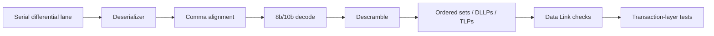

# PCI Express Gen1 Simulation Project

A three-phase PCIe study using an AMD/Xilinx example-design simulation environment and course-provided PHY analysis utilities. The work progresses from physical-layer symbol recovery to Data Link behavior and finally Transaction-layer configuration/memory tests.

## Phases

1. **[Physical layer](phase-1-physical-layer/)** — x1 baseline, symbol decoding, LTSSM/training analysis, x4 extension, byte striping, lane skew.
2. **[Data Link](phase-2-data-link/)** — DLLP/TLP framing, sequence/LCRC concepts, replay/ACK behavior, and fault-injection experiments.
3. **[Transaction layer](phase-3-transaction-layer/)** — configuration space, Memory Read/Write, Completion behavior, throughput benchmark, 256 KB BAR, multi-function endpoint, and GPIO register-map experiment.

## Important source note

The raw simulation folders contain large generated traces and AMD/Xilinx example-design sources with explicit proprietary notices. They are **not redistributed** in this portfolio. The READMEs retain the experiment design, student modifications, measured results, and limitations without presenting vendor code as original work.
